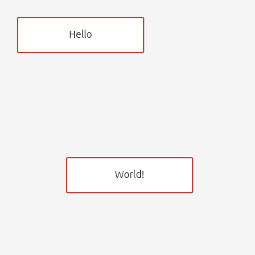

# playground-jointjs

Personal jointjs playground to experiment features provided by this library.

## Content

Create a sample application built with Vite 6.2 and integrating jointjs 4.1.3.

Content: follow the quickstart until https://docs.jointjs.com/learn/quickstart/elements/

Result: total bundle size is about **390.8 kB**.

*Screenshot of the application*

## Development

setup: `npm install`

Then:

- dev-server: `npm run dev`
- build: `npm run build`
